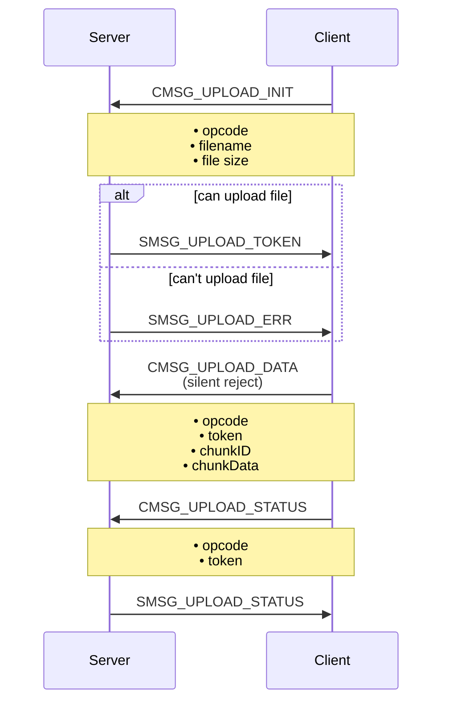

```mermaid
sequenceDiagram
    participant S as Server
    participant C as Client


    C->>S: CMSG_UPLOAD_INIT
    Note over C,S: • opcode<br/>• filename<br/>• file size

    alt can upload file
        S->>C: SMSG_UPLOAD_TOKEN
    else can't upload file
        S->>C: SMSG_UPLOAD_ERR
    end

    C->>S: CMSG_UPLOAD_DATA<br/>(silent reject)
    Note over C,S: • opcode<br/>• token<br/>• chunkID<br/>• chunkData

    C->>S: CMSG_UPLOAD_STATUS
    Note over C,S: • opcode<br/>• token

    S->>C: SMSG_UPLOAD_STATUS
```
